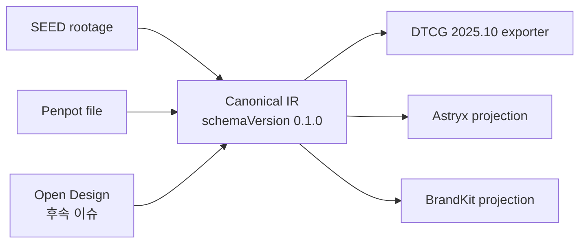

# 통합 디자인 토큰 계약(canonical design token contract) 명세

> 상태: Proposed (조사·명세 완료, 리뷰 반영, 구현 대기)
>
> 작성일: 2026-08-08 · 갱신일: 2026-08-08 (2차 리뷰 반영 — 11·12장)
>
> 관련 이슈: [#30](https://github.com/Doyajin174/teguma/issues/30) — Refs #22 #23 #28

## 1. 목표

Penpot·SEED·향후 디자인 시스템 어댑터가 **공통으로 생산**하고 Astryx 등 exporter가 **공통으로 소비**하는, 버전 고정 canonical design token 계약을 정의한다.

canonical은 **Teguma의 lossless internal IR**이다. DTCG(Design Tokens) 교환 문서가 아니며, DTCG와의 호환은 별도 projection(6.4) 경계에서만 다룬다 (3장).

현재 각 연동은 서로 다른 토큰 의미를 개별 어댑터에서 보정 중이다:

| 어댑터 | mode | role | provenance | loss |
| --- | --- | --- | --- | --- |
| Penpot `get_tokens` (compressor) | 없음 | coarse role(이름 정규식 추론) | path를 name에 합성(분리 저장 안 함) | 암묵적(letterSpacing·textTransform·gradient 탈락, spacing 추론) → importLoss로 명시화 |
| SEED 변환기 | `theme-light`/`theme-dark`/`default` (컬렉션별 규칙) | 없음(추정 금지) | collection·path·mode 유지 | 구조화된 `manifest.unsupported` → importLoss |
| Astryx 변환기 | 별도 `modes` wrapper(POC 확장) | `roleOverrides`만 허용(추측 방지) | sourceToken 이름만 | 구조화된 `warnings` + `mapping` 상태 → projection loss |
| Open Design | 미정 (후속 이슈) | 미정 | 미정 | 미정 |

이 상태로 어댑터를 더 붙이면 mode·role·provenance·unsupported 보고 형식이 달라지고, 같은 디자인 시스템이 경로에 따라 다르게 해석될 수 있다.

## 2. 설계 원칙

1. **버전 고정** — canonical 문서는 `schemaVersion`을 필수로 갖는다. 계약 변경은 semver로 관리하고 이 문서에 기록한다.
2. **결정론** — 동일 입력은 동일 canonical JSON과 동일 loss manifest를 생성한다. 타임스탬프·랜덤 id·가변 순서 금지. 문서 순서는 입력 순서가 아니라 4.8의 고정 정렬 규칙을 따른다.
3. **추측 금지** — semantic role은 `explicit | mapped | unknown` 확실성을 함께 가진다. `mapped`(휴리스틱 추론) role은 소비자가 자동 확정하지 못한다. Astryx 등 exporter는 `explicit` 또는 명시적 override만 semantic 변수에 배정한다.
4. **손실은 구조화·분리** — 해석할 수 없는 토큰은 조용히 버리지 않는다. **import 손실**(어댑터 → canonical)은 문서의 `importLoss`에, **projection 손실**(canonical → 소비자)은 projection 결과의 `loss`에 담는다(5·6장). 항목은 `tokenId/path + mode + code`로 구분한다.
5. **무의존** — JSON 스키마 + 저장소 표준(zod v3, 이미 의존성)으로만 표현·검증한다. 새 런타임 의존성 없음.
6. **호환** — 기존 MCP 도구 계약을 깨지 않는다. canonical은 additive로 노출한다(8장).

## 3. 아키텍처: canonical IR과 DTCG 교환 형식 분리



- canonical은 **DTCG 문서가 아니다**. `$type`/`$value` 예약 속성이나 그룹 상속 같은 DTCG 파일 규약을 따르지 않는 Teguma 전용 lossless IR이다. mode·alias·role 확실성·import loss처럼 DTCG에 1급 개념이 없는 정보를 손실 없이 담는 것이 목적이다.
- **DTCG와의 교환은 전용 projection**으로 수행한다: `canonical → DTCG 2025.10`(exporter, 6.4)와 `DTCG 2025.10 → canonical`(import, 6.4 — **v0.2 예정**). canonical 자체의 "DTCG 형식 호환" 주장은 하지 않는다.
- canonical의 값 모델은 DTCG 2025.10 Final Community Group Report의 값 구조·단위·타입 어휘를 참조해 정렬한다(4.5). 자세한 DTCG 사실관계는 `docs/research/018-dtcg-compatibility.md`.

## 4. canonical token document 스키마 (v0.1.0)

### 4.1 문서 뼈대

```ts
interface CanonicalTokenDocument {
  schemaVersion: "0.1.0";
  document: {
    id: string;                       // "canonical:<adapter>:<source-id>"
    sourceAdapter: "penpot" | "seed" | "open-design";  // v0.2: DTCG import 도입 시 "dtcg" 추가 예정
    sourceName: string;
    sourceRevision?: string;          // 원본 버전/리비전이 있을 때만
  };
  tokens: CanonicalToken[];           // 4.2 — 정렬: id 기준 (4.8)
  importLoss: CanonicalLossManifest;  // 4.6 — import 손실
}
```

- `document.id`는 어댑터·소스 id로부터 결정적으로 생성한다 (`canonical:<adapter>:<source-id>`).
- 타임스탬프 계열 필드는 두지 않는다 (결정론 위반).

### 4.2 토큰 객체 — logical token + mode별 values

```ts
interface CanonicalToken {
  id: string;                 // logical identity (mode 무관, 필수)
  name?: string;              // 표시 이름
  path: string;               // 원본 경로 (필수)
  type: CanonicalType;        // 4.5 (필수)
  kind?: CanonicalKind;       // 폐쇄 enum — 아래 선언 (spacing/radius/font-size 등 하위 구분)
  values: {
    default?: CanonicalModeValue;  // 4.3
    light?: CanonicalModeValue;
    dark?: CanonicalModeValue;
  };
  semanticRole?: { role: string; confidence: "explicit" | "mapped" | "unknown" };  // 4.7
  provenance: {               // (필수)
    adapter: "penpot" | "seed" | "open-design";  // v0.2: DTCG import 도입 시 "dtcg" 추가 예정
    sourcePath: string;
    sourceId: string;
    collection?: string;      // SEED 등 어댑터별 추가 정보
  };
  description?: string;
}

type CanonicalKind =
  | "spacing"
  | "font-size"
  | "line-height"
  | "letter-spacing"
  | "radius";   // 폐쇄 enum (v0.1) — kind 추가는 계약 변경(schemaVersion bump)
```

**logical identity 규칙**

- `id`는 **mode와 무관한 logical 식별자**다. 같은 원본 path가 light/dark 값을 모두 가지면 **한 토큰 객체의 `values`에 병합**한다 — 동일 `id`가 문서에 두 번 나타나지 않는다.
- id 규칙: Penpot `penpot:<fileId>:<colorId|typoId>`, SEED `seed:<path>` (예: `seed:$dimension.x4`). 변경 금지 — alias·override 참조 대상.
- **alias.ref는 logical id를 가리킨다** (mode 포함 id가 아님). 해석은 소비 시점의 mode 규칙을 따른다.
- 소비자가 mode별 인스턴스 객체가 필요하면 `id@mode` 파생 식별자를 쓴다 (예: `seed:$color.palette.carrot-600@dark`). 문서 자체는 logical 단위로만 저장한다.

**mode 해석 규칙** (projection 공통, 6.1)

1. 요청 mode의 `values[mode]`가 있으면 그것을 사용한다.
2. 없으면 `values.default`를 사용한다.
3. **light↔dark 절대 fallback 없음** — 없으면 기본 code **`missing-mode`**로 보고한다 (projection loss `ambiguous`). 예: 요청 dark인데 dark·default 모두 없으면 light로 대체하지 않는다. projection별 세분 code 허용 — Astryx는 `missing-light`/`missing-dark`를 쓴다 (6.3).

**mode 매핑**: Penpot은 mode를 모르므로 `default`에만 값. SEED는 `theme-light→light`, `theme-dark→dark`, global 컬렉션→`default`.

### 4.3 mode 값 — Zod discriminated union

```ts
type CanonicalModeValue =
  | {
      status: "resolved";
      raw: JsonValue;                   // 해석 전 원문 — 구조 보존, JSON 문자열 stringify 금지
      resolvedValue: CanonicalValue;    // 4.4
      alias?: ResolvedAlias;            // { ref: string; resolved: true } — 참조 관계 (선택)
    }
  | {
      status: "unresolved";
      raw: JsonValue;                   // 구조 보존
      alias: UnresolvedAlias;
    };

type ResolvedAlias = { ref: string; resolved: true };
type UnresolvedAlias = { ref: string; resolved: false; reason: UnresolvedReason };
type UnresolvedReason = "circular" | "missing";  // 폐쇄 union (v0.1) — reason 추가는 계약 변경
```

- 구현은 `z.discriminatedUnion("status", [resolvedSchema, unresolvedSchema])`을 **필수**로 사용한다. 임의 optional 필드(`value` 생략 가능 등)가 생기지 않는다.
- `raw`는 **구조화된 JsonValue**다. SEED rootage 객체·DTCG 값 객체·hex 문자열 등 원문을 그대로 보존하며, JSON 문자열로 stringify해 저장하지 않는다.
- `resolved` 상태의 `alias`는 해석 완료(참조 대상 값 적용), `unresolved`는 해석 불가(순환·미존재)를 뜻한다.
- `unresolved.reason`은 폐쇄 union이다 — zod `z.enum(["circular", "missing"])`으로 검증한다. 새 reason 추가는 계약 변경(schemaVersion bump)으로 다룬다.

### 4.4 정규화 값·단위

```ts
interface CanonicalValue {
  sourceValue: CanonicalScalar;     // 원문 단위·구조 그대로 (정규화 전)
  resolvedValue: CanonicalScalar;   // 정규화·해석 후 값 — 소비 기준
  conversion?: ConversionRecord;    // sourceValue → resolvedValue 근거
}

interface CanonicalScalar {
  value: number | string | string[] | number[] | ColorStruct;  // type별 4.5
  unit?: "px" | "rem" | "ms" | "s" | "%";
}

type ConversionRecord =
  | { kind: "rem-to-px"; rootFontSizePx: number }
  | { kind: "percent-to-ratio" }        // lineHeight "150%" → 비율 1.5
  | { kind: "identity" };
```

- 소비자는 **`resolvedValue`를 기준**으로 사용한다. 원문 단위가 필요하면 `sourceValue`·`conversion`으로 재현한다 — "값은 px로 정규화했는데 `unit: "rem"`" 같은 모순이 생기지 않는다.
- 예:

```jsonc
{
  "status": "resolved",
  "raw": "0.6875rem",
  "resolvedValue": {
    "sourceValue": { "value": 0.6875, "unit": "rem" },
    "resolvedValue": { "value": 11, "unit": "px" },
    "conversion": { "kind": "rem-to-px", "rootFontSizePx": 16 }
  }
}
```

- 단위가 바뀌지 않는 값은 `sourceValue === resolvedValue`이고 `conversion`을 생략한다.
- `dimension`의 공식 단위는 `px | rem`(DTCG 2025.10). 그 외 단위(예: `vw`)는 `sourceValue`에 보존하되 `importLoss.lossy`(code `nonstandard-unit`)로 보고한다. `%`는 비율 의미의 `lineHeight`(`kind: "line-height"`, number)에서 허용한다 — 이 경우 `resolvedValue`는 비율 number로 정규화하고 `conversion: { kind: "percent-to-ratio" }`를 기록한다.

### 4.5 토큰 타입 (v0.1.0)

canonical 타입 어휘는 DTCG 2025.10의 공식 tokenType 13종(`color, dimension, fontFamily, fontWeight, duration, cubicBezier, number, strokeStyle, border, transition, shadow, gradient, typography`)과 정렬한다. **fontSize·lineHeight·letterSpacing·radius는 DTCG 독립 타입이 아니므로** `dimension`/`number` + `kind`로 표현한다.

| canonical type | 값 형태 (`CanonicalScalar`) | 비고 |
| --- | --- | --- |
| `color` | `{ value: { colorSpace, components, alpha?, hex? } }` | DTCG color 구조를 `CanonicalScalar.value`에 래핑. hex 문자열 입력은 `srgb` 구조로 정규화. Penpot opacity는 `alpha`로 변환하고 `importLoss.lossy` 기록 |
| `dimension` | `{ value: number, unit: "px" \| "rem" }` | spacing·fontSize·letterSpacing·radius·lineHeight(단위 있음)는 `kind`로 구분 |
| `fontFamily` | `string \| string[]` | |
| `fontWeight` | 1..1000 정수 또는 DTCG 규정 문자열 alias | alias는 정수로 정규화해 저장 가능, 원문은 `raw` 보존 |
| `duration` | `{ value: number, unit: "ms" \| "s" }` | SEED `$duration.d3`(150ms) 지원 |
| `number` | `number` | 단위 없는 값 — lineHeight 비율 등 |

v0.2 후보: `cubicBezier`, `strokeStyle`, `border`, `transition`, `shadow`, `gradient`, `typography` (어휘는 DTCG와 정렬).

- `fontWeight` alias 문자열·`colorSpace` 열거 값의 완전한 목록은 공식 JSON Schema(<https://www.designtokens.org/schemas/2025.10/format.json>)를 참조한다 — 본 문서에서 열거를 생략한다 (zod 구현 시 해당 스키마에서 추출).

**비독립 타입 판정 표**:

| 구분 | v0.1.0 판정 | 근거 |
| --- | --- | --- |
| fontSize | `dimension` + `kind: "font-size"` | 독립 DTCG 타입 아님 |
| lineHeight | 단위 없는 비율 → `number` + `kind: "line-height"` / 단위 있는 값 → `dimension` + `kind: "line-height"` | 독립 DTCG 타입 아님 |
| letterSpacing | `dimension` + `kind: "letter-spacing"` | 독립 DTCG 타입 아님 |
| radius | `dimension` + `kind: "radius"` | 독립 DTCG 타입 아님. 모서리별 다중 값은 v0.2 |
| spacing | `dimension` + `kind: "spacing"` | DTCG에 spacing 타입 없음 |
| shadow/gradient/border/transition/strokeStyle/cubicBezier/typography | v0.2 후보 | 현재 어댑터가 생산하는 데이터 없음 (Penpot 미노출, SEED는 unsupported 보고) |

### 4.6 import loss manifest

```ts
interface CanonicalLossManifest {
  unsupported: CanonicalLossItem[];  // 해석 불가 (범주·단위·구조)
  ambiguous: CanonicalLossItem[];    // 값은 있으나 의미를 확정할 수 없음
  lossy: CanonicalLossItem[];        // 변환 과정에서 정보가 변형·소실됨
}

interface CanonicalLossItem {
  tokenId?: string;                  // logical id (대상 토큰이 있으면)
  path: string;                      // 원본 경로 (필수 — tokenId 없어도 구분)
  mode?: "default" | "light" | "dark";  // 같은 path의 mode별 실패 구분
  code: string;                      // 머신 판독 코드 (예: "unsupported-category", "unit-conversion", "dropped-property")
  reason: string;
  raw?: JsonValue;                   // 원문 — 구조 보존 (stringify 금지)
  candidates?: string[];             // ambiguous 전용
  original?: JsonValue;              // lossy 전용 — 원문 그대로 (구조 보존, stringify 금지)
  converted?: CanonicalScalar;       // lossy 전용 — canonical 값 형태
}
```

**import 손실은 문서에 귀속된다** — 동일 입력이면 동일 `importLoss`이며 소비자와 무관하다 (5장 import). 소비 단계 손실은 6장 projection 결과로 분리한다.

기존 보고 형식과의 대응:

| 기존 형식 | canonical importLoss |
| --- | --- |
| SEED `manifest.unsupported` (범주·단위·mode 부재) | `unsupported`로 이동 — `mode`·`raw`(구조 보존) 포함 |
| Penpot compressor의 암묵적 탈락(letterSpacing·textTransform·gradient) | `lossy`/`unsupported`로 명시화 |
| Penpot spacing 추론(GCD base unit·기본 스케일) | `lossy` (추론임을 명시) |
| Astryx `warnings`(MISSING_ROLE 등)·`mapping` conflict | canonical 문서가 아니라 **projection loss**(6.3)로 처리 |

### 4.7 semantic role 확실성

| confidence | 의미 | 자동 매핑 허용 |
| --- | --- | --- |
| `explicit` | 원본이 role을 선언 (SEED 컬렉션 의미·rootage 명시, Astryx `roleOverrides`, 사용자 지정) | 허용 (registry 검증 후) |
| `mapped` | 휴리스틱 추론 (Penpot `inferColorRole` 정규식 — `primary`/`secondary`/`neutral`/`semantic`/`surface`/`text`) | **금지** — 소비자는 override를 요구하거나 `ambiguous` 보고 |
| `unknown` | role 없음 (필드 생략과 동일) | 금지 |

### 4.8 결정론 정렬 규칙

입력 순서에 의존하지 않는 고정 정렬:

1. `tokens`: `id` 오름차순 (locale 무관 바이트 순).
2. 토큰 내 `values` 키 순서: `default` → `light` → `dark`.
3. `importLoss`: category 고정 순서 `unsupported` → `ambiguous` → `lossy`, 항목 내 `tokenId`(없으면 `path`) 오름차순 → `mode`(순서 `default`→`light`→`dark`, 없으면 생략) → `code` 오름차순. 동률이면 `raw` 직렬화 문자열 오름차순 → `reason` 오름차순 (입력 순서 의존 제거).
4. projection loss도 같은 규칙을 준용한다 (6.1).

## 5. 어댑터 (import: 원본 → canonical)

### 5.1 Penpot compressed token → canonical

- 입력: `PenpotFile` + `compressBrandContext` 결과(압축 토큰).
- colors:
  - `name`(path/name 합성)은 `path`와 `name`으로 분리해 보존 (`provenance.sourcePath`).
  - `value`의 `@NN%` 불투명도 접미사는 DTCG color 구조의 `alpha`로 변환하고 `importLoss.lossy`에 원문 기록 (Astryx `normalizeColorValue`의 "UNSUPPORTED" 탈락 문제 해소).
  - `role`은 `semanticRole.confidence: "mapped"`로 보존 — 출처가 정규식 추론임을 명시. Astryx가 자동 확정하지 못한다.
  - gradient가 있으면 `importLoss.unsupported`(code `unsupported-category`)로 보고 (v0.2에서 보존).
- typography: `scale` 항목을 토큰별로 분해 — `fontSize`→dimension(`kind: "font-size"`), `fontWeight`→fontWeight, `lineHeight`→number/dimension(`kind: "line-height"`), `letterSpacing`→dimension(`kind: "letter-spacing"`). textTransform은 표현 불가 → `importLoss.lossy`(code `dropped-property`).
- spacing: shape에서 추론한 `baseUnit`·`scale`은 dimension(`kind: "spacing"`) 토큰 + `importLoss.lossy`("추론") 기록.
- mode: `default` (Penpot에 light/dark 없음). alias: 없음(flat 구조). provenance: `penpot:<fileId>` + 원본 id.

### 5.2 SEED rootage → canonical

- 입력: `SeedRootageFile` + `SeedTransformOptions`(mode·rootFontSizePx).
- category → type/kind 매핑: `dimension→dimension`, `font-family→fontFamily`, `font-weight→fontWeight`, `font-size→dimension(+kind font-size)`, `line-height→number|dimension(+kind line-height)`, `letter-spacing→dimension(+kind letter-spacing)`, `radius→dimension(+kind radius)`, `duration→duration`, `color→color`.
- mode: `theme-light→values.light`, `theme-dark→values.dark`, `default→values.default`. **같은 path가 light/dark를 모두 가지면 한 logical 토큰의 `values`에 병합**한다 (4.2).
- `raw`가 `$` 참조면 `alias.ref` = 대상 logical id, 해석 성공 시 `status: "resolved"`, 순환·미존재 시 `status: "unresolved"` (기존 `resolveScalar` 순환 감지 재사용).
- rem→px 환산은 `sourceValue`(rem)·`resolvedValue`(px)·`conversion.rootFontSizePx`로 보존 — 기존 결과 회귀 금지.
- `manifest.unsupported` → `importLoss.unsupported` (`mode`·`raw` 포함). color에 `default` 요청 시의 unsupported 보고도 동일.
- semanticRole: rootage에 role 개념 없음 → 부재(unknown). 단, `provenance.collection`(`color`/`global`)을 보존해 역할 판단 근거로만 사용.

### 5.3 Open Design → canonical

- 다이어그램(3장)에 따라 Open Design도 canonical 생산 어댑터로 들어온다. 어댑터 정의·구현은 별도 이슈에서 진행하며, 본 문서는 계약(4장)만 제공한다.

## 6. projection (canonical → 소비자)

### 6.1 공통 계약

```ts
interface ProjectionResult<T> {
  value: T;                 // 소비자 형식 결과
  loss: ProjectionLossManifest;  // 소비자별 손실 — canonical 문서를 변경하지 않음
}
```

- projection은 canonical 문서를 수정하지 않는다. 소비자별 손실은 결과의 `loss`에 담는다 (import 손실과 분리 — 2장 원칙 4).
- `ProjectionLossManifest`는 4.6과 같은 category 구조(`unsupported`/`ambiguous`/`lossy`)를 쓰고, 정렬도 4.8을 준용한다. code 어휘는 projection마다 정의한다.
- **mode 해석**은 4.2 규칙을 따른다: 요청 mode → 없으면 `default` → 없으면 `loss.ambiguous`(code `missing-mode`) 보고. light↔dark 교차 fallback 없음.

### 6.2 canonical → BrandKit / DesignDocument projection

- projection 파라미터: `mode` (필수 — `light`/`dark`/`default`), 선택적으로 `kitId`·`kitName`.
- palette: mode 해석(4.2) 후 일치하는 `color` 토큰만. 요청 mode·`default` 모두 없으면(SEED `default` 호출과 동일) `loss.ambiguous`(code `missing-mode`) 보고 후 palette 생략 — 기존 정책 유지.
- fonts: `fontFamily` + `fontWeight` 토큰으로 family별 weight 목록. family↔weight 연관이 없는 경우 `loss.lossy`("합집합 등록 — 기존 POC 한계") 명시.
- BrandKit이 표현하지 못하는 타입/kind(radius·shadow·gradient·duration 등) → `loss.unsupported`.
- DesignDocument 생성은 기존 `buildSeedDocument` 로직을 projection의 별도 단계로 일반화 (대표 문서 생성 정책은 v0.2에서 문서화).
- 기존 `SeedTransformResult`의 `manifest`/`brandKit`/`typography`/`spacing`/`document` 필드는 유지 — canonical은 additive 필드로 추가.

### 6.3 canonical → Astryx theme draft

- 입력: canonical token document + (선택) `roleOverrides` — projection 파라미터로, **canonical token `id`(logical)를 참조**한다 (현행 이름 문자열 의존 제거).
- 출력: 기존 `AstryxThemeDraft` 유지. **별도 `modes` wrapper가 불필요해진다** — canonical `values`에서 mode를 직접 채운다 (4.2 해석 규칙).
- 매핑 규칙:
  - `semanticRole.confidence === "explicit"` 토큰만 `COLOR_ROLE_REGISTRY`와 매칭 시도.
  - `mapped`(Penpot 추론 role)는 **자동 매핑 금지** → `unmapped` + `MISSING_ROLE`/`UNSUPPORTED_TOKEN` 경고 (현행 no-guess 원칙 유지).
  - override는 canonical `id` 기반으로 명시적 role을 부여 → `explicit`로 취급.
- 충돌(M3 규칙: 한 번 conflict로 내려간 변수는 복원 금지) → `mapping.status: "conflict"` + `loss.ambiguous` 병기.
- typography/spacing: 현행 규칙 유지(4/8 base unit, 단조 증가·배수 검사 등). 위반은 `unmapped` + 경고.
- mode 누락(light만 존재 등): `loss.ambiguous`(code `missing-light`/`missing-dark` — 4.2 규칙 3 기본 code `missing-mode`의 Astryx 세분 code) 병기 — 기존 `MISSING_DARK_MODE`/`MISSING_LIGHT_MODE` 경고 대체.
- `roleOverrides`는 canonical id 참조로 바뀌므로, 기존 get_tokens 이름 기반 override는 migration 기간 동안 이름→id 역참조 맵으로 지원.

### 6.4 canonical ↔ DTCG 2025.10 (projection)

canonical은 DTCG 문서가 아니므로, DTCG 도구·파일과의 교환은 이 projection에서만 수행한다 (3장).

**canonical → DTCG 2025.10 문서**

- 입력: canonical 문서 + `mode` 파라미터 (단일 mode — DTCG에 1급 mode가 없으므로, 다중 mode 문서(그룹 분리 관례)는 v0.2).
- path → 그룹 계층, 토큰 → `$type`/`$value`/`$description`.
- 타입 매핑:
  - `color` → `$type: "color"`, 값 = DTCG color 구조 (`hex` 단축 표기 허용).
  - `dimension` → `$type: "dimension"`, `{ value, unit }` (`px`/`rem`).
  - `fontSize`/`letterSpacing`/`radius` → `$type: "dimension"` (독립 타입 없음). `kind` 구분은 DTCG에 1급 표현이 없으므로 `$description`에 병기하고 `loss.lossy`(code `kind-collapsed`) 기록.
  - `lineHeight` → 단위 없는 비율: `$type: "number"`, 단위 있는 값: `$type: "dimension"`.
  - `fontWeight` → 1..1000 정수 (문자열 alias는 정규화).
  - `duration` → `$type: "duration"`, `{ value, unit }` (`ms`/`s`).
- alias: `{path}` 참조 문법으로 변환 (logical id → 그룹 경로). `unresolved` alias는 DTCG 문서에 넣지 않고 `loss.unsupported` 보고.
- 값 선택은 4.2 mode 해석 규칙을 따르고, mode 누락은 `loss.ambiguous`(code `missing-mode`).

**DTCG 2025.10 → canonical (import — v0.2 후속)**

- **v0.1 범위는 exporter만 포함한다** (9.2 DoD). import는 v0.2에서 도입하며, 그때 `sourceAdapter`(4.1)·`provenance.adapter`에 `"dtcg"`를 추가한다.
- 공식 JSON Schema 검증 후 변환: color 구조·hex, dimension 구조/문자열 파싱, fontWeight alias 정규화(1..1000), 그룹 → `path`, `{path}` → `alias.ref`(logical id로 매핑 — 그룹 경로 기반 결정적 id).
- DTCG에서 표현할 수 없는 정보(mode 다중 등)는 `importLoss`로 보고.

**검증**: exporter 출력은 공식 스키마 <https://www.designtokens.org/schemas/2025.10/format.json>으로 검증한다 (구현 단계).

## 7. 완료 시나리오 (이슈 본문 기준)

1. 사용자가 SEED rootage의 light/dark 토큰을 가져오거나 Penpot 파일에서 토큰을 읽는다.
2. 두 입력 모두 같은 버전의 canonical token document로 정규화된다 — 5.1·5.2 어댑터가 `schemaVersion` 동일 문서를 생산. 같은 path의 light/dark는 한 logical 토큰의 `values`에 보존된다.
3. 원본 이름·경로·타입·kind·mode별 값·alias 관계·semantic role 확실성·단위·출처가 보존된다 — 4.2~4.5 필드(provenance·alias·semanticRole·sourceValue/resolvedValue/conversion)로 보장. 해석 불가·변형은 `importLoss`로 명시된다.
4. Astryx exporter가 별도 임시 `modes` wrapper 없이 canonical을 소비하고, 확정할 수 없는 role만 override 요구 또는 projection loss 보고로 반환한다 — 6.3.
5. 동일 입력은 동일 canonical JSON과 동일 loss manifest를 생성한다 — 원칙 2(결정론) + 4.8 정렬 규칙 (입력 순서 무관).
6. DTCG 도구와의 교환이 필요하면 exporter(6.4)로 단일 mode DTCG 문서를 생성하고 검증한다.

## 8. 호환성·migration

### 8.1 선택: additive 파라미터 (v0.1.0)

`get_tokens`에 **`includeCanonical?: boolean`(기본 false)** 파라미터를 추가한다. `true`면 응답에 `canonical` 필드(전체 canonical 문서)를 덧붙인다.

**category 상호작용 — (b) 선택: 선택 category만 반환**

`includeCanonical=true`일 때 `canonical` 필드는 `category`와 **동일한 선택 범위**를 반영한다.

| category | canonical 필드 내용 |
| --- | --- |
| `all` | 전체 문서 — `tokens` 전체 + `importLoss` 전체 |
| `colors` | `color` 토큰 + 관련 `importLoss` |
| `typography` | `fontFamily`/`fontWeight` + `dimension`(`kind: font-size\|line-height\|letter-spacing`)/`number`(`kind: line-height`) 토큰 + 관련 `importLoss` |
| `spacing` | `dimension`(`kind: spacing`) 토큰 + 관련 `importLoss` |

- 그룹 판별: `provenance`의 원본 그룹을 우선하고, 없으면 type/kind 매핑으로 판별한다.
- `importLoss` 항목도 `tokenId`/`path`로 같은 범위에 속하는 항목만 포함한다.
- 선택 근거: 기존 `category` 의미를 유지하고 페이로드가 요청 범위에 비례하며, 손실 보고가 반환 토큰과 정합한다. (a) category 무관 전체 반환은 category 선택을 무시해 기존 의미와 이중적이고, (c) `category=all`만 허용은 additive 조합을 불필요하게 제약한다.

선택 근거(전체): Penpot 파일 fetch를 1회 재사용 (별도 도구는 fetch 중복). 기본 동작 불변 → 기존 소비자 무영향. canonical payload 자체가 `schemaVersion`으로 versioned → additive로도 버전 관리 충분. SEED는 `transformSeedRootage` 결과에 additive `canonical` 필드 추가 (기존 필드 유지).

### 8.2 migration 경로

| 단계 | 상태 | 내용 |
| --- | --- | --- |
| v0 (현재) | 운영 중 | `get_tokens` 압축 형식만 존재. |
| v0.1 | 이 이슈 구현 후 | `includeCanonical` 기본 off. canonical은 새 기능으로만 노출. 기존 형식 유지. |
| v1.0 | 후속 | `includeCanonical` 기본 on. 기존 압축 형식은 canonical→projection 결과임을 명시. Astryx `modes` wrapper deprecated. |
| v2.0 | 후속 | 기존 압축 형식 필드 제거 예정. 모든 소비자는 canonical + projection 사용. |

### 8.3 Astryx 전용

- `AstryxThemeInput`에 canonical 소비 경로 추가 (기존 `modes`·`roleOverrides` 입력은 deprecated 표시).
- `roleOverrides`의 참조를 canonical `id`로 전환. 기존 이름 참조는 migration 맵으로 지원.

## 9. 완료 조건 (Definition of Done)

### 9.1 본 이슈 범위 (조사·명세)

- [x] DTCG 호환성 조사 문서 — `docs/research/018-dtcg-compatibility.md` (2025.10 Final CGR + 공식 JSON Schema 기준)
- [x] versioned canonical token schema + 예시 JSON 명세 — 본 문서
- [x] 리뷰 지적 반영 — 11·12장

### 9.2 구현 단계 (후속 PR — 이 이슈의 구현 범위)

> **이 PR 범위**: 스키마·어댑터 4종(seed·penpot·astryx·brandkit)·결정론. DTCG exporter(6.4)와 `includeCanonical`(8.1)은 이 PR 범위가 아니며 후속 PR로 분리한다.

- [ ] zod 기반 canonical 스키마 (`src/design/canonical-token.ts` 등) — `z.discriminatedUnion`(4.3) 포함, 저장소 표준 zod v3, 새 의존성 없음
- [ ] logical token + mode별 `values`, alias(logical id 참조), provenance, semantic certainty, `importLoss`/projection loss 분리를 포함한 fixture
- [ ] Penpot fixture와 SEED fixture가 같은 canonical contract로 변환됨 (5.1·5.2)
- [ ] 기존 SEED mode·참조·단위 결과가 회귀 없이 보존됨 (manifest 유지 + canonical additive)
- [ ] Astryx 변환기가 canonical을 소비하고 모호한 role을 추측하지 않음 (6.3, `mapped` 자동 매핑 금지)
- [ ] 기존 `BrandKit`/`DesignDocument` 소비자를 위한 projection (6.2) + migration 문서 (8장)
- [ ] DTCG 2025.10 exporter (6.4) + 공식 JSON Schema 검증 — **후속 PR**
- [ ] 동일 입력의 canonical JSON·loss manifest 결정론 테스트 (4.8 정렬 규칙)
- [ ] 전체 테스트·빌드 통과
- [ ] PR → 셀프 리뷰 → 독립 AI 리뷰 → squash merge

## 10. 예시 JSON

### 10.1 SEED → canonical (축약)

```jsonc
{
  "schemaVersion": "0.1.0",
  "document": { "id": "canonical:seed:seed-poc", "sourceAdapter": "seed", "sourceName": "Seed POC" },
  "tokens": [
    {
      "id": "seed:$color.palette.carrot-600",
      "name": "carrot-600",
      "path": "$color.palette.carrot-600",
      "type": "color",
      "values": {
        "light": {
          "status": "resolved",
          "raw": "#ff6600",
          "resolvedValue": {
            "sourceValue": { "value": { "colorSpace": "srgb", "components": [255, 102, 0], "alpha": 1, "hex": "#ff6600" } },
            "resolvedValue": { "value": { "colorSpace": "srgb", "components": [255, 102, 0], "alpha": 1, "hex": "#ff6600" } }
          }
        },
        "dark": {
          "status": "resolved",
          "raw": "#e05a00",
          "resolvedValue": {
            "sourceValue": { "value": { "colorSpace": "srgb", "components": [224, 90, 0], "alpha": 1, "hex": "#e05a00" } },
            "resolvedValue": { "value": { "colorSpace": "srgb", "components": [224, 90, 0], "alpha": 1, "hex": "#e05a00" } }
          }
        }
      },
      "provenance": { "adapter": "seed", "sourcePath": "$color.palette.carrot-600", "sourceId": "seed-poc", "collection": "color" }
    },
    {
      "id": "seed:$dimension.spacing-x.global-gutter",
      "name": "global-gutter",
      "path": "$dimension.spacing-x.global-gutter",
      "type": "dimension",
      "kind": "spacing",
      "values": {
        "default": {
          "status": "resolved",
          "raw": "$dimension.x4",
          "alias": { "ref": "seed:$dimension.x4", "resolved": true },
          "resolvedValue": {
            "sourceValue": { "value": 16, "unit": "px" },
            "resolvedValue": { "value": 16, "unit": "px" }
          }
        }
      },
      "semanticRole": { "role": "spacing", "confidence": "explicit" },
      "provenance": { "adapter": "seed", "sourcePath": "$dimension.spacing-x.global-gutter", "sourceId": "seed-poc", "collection": "global" },
      "description": "화면 전체에 적용되는 기본 수평 padding 값입니다."
    },
    {
      "id": "seed:$font-size.t1",
      "name": "t1",
      "path": "$font-size.t1",
      "type": "dimension",
      "kind": "font-size",
      "values": {
        "default": {
          "status": "resolved",
          "raw": "0.6875rem",
          "resolvedValue": {
            "sourceValue": { "value": 0.6875, "unit": "rem" },
            "resolvedValue": { "value": 11, "unit": "px" },
            "conversion": { "kind": "rem-to-px", "rootFontSizePx": 16 }
          }
        }
      },
      "provenance": { "adapter": "seed", "sourcePath": "$font-size.t1", "sourceId": "seed-poc", "collection": "global" }
    },
    {
      "id": "seed:$duration.d3",
      "name": "d3",
      "path": "$duration.d3",
      "type": "duration",
      "values": {
        "default": {
          "status": "resolved",
          "raw": "150ms",
          "resolvedValue": {
            "sourceValue": { "value": 150, "unit": "ms" },
            "resolvedValue": { "value": 150, "unit": "ms" }
          }
        }
      },
      "provenance": { "adapter": "seed", "sourcePath": "$duration.d3", "sourceId": "seed-poc", "collection": "global" }
    },
    {
      "id": "seed:$dimension.breakpoint.md",
      "name": "md",
      "path": "$dimension.breakpoint.md",
      "type": "dimension",
      "values": {
        "default": {
          "status": "unresolved",
          "raw": "$dimension.breakpoint.not-found",
          "alias": { "ref": "seed:$dimension.breakpoint.not-found", "resolved": false, "reason": "missing" }
        }
      },
      "provenance": { "adapter": "seed", "sourcePath": "$dimension.breakpoint.md", "sourceId": "seed-poc", "collection": "global" }
    }
  ],
  "importLoss": {
    "unsupported": [
      {
        "path": "$color.gradient.hero",
        "mode": "default",
        "code": "unsupported-category",
        "reason": "gradient 구조는 v0.2에서 보존",
        "raw": { "values": { "default": { "from": "#ff6600", "to": "#000000" } } }
      }
    ],
    "ambiguous": [],
    "lossy": []
  }
}
```

### 10.2 Penpot → canonical (축약)

```jsonc
{
  "schemaVersion": "0.1.0",
  "document": { "id": "canonical:penpot:<fileId>", "sourceAdapter": "penpot", "sourceName": "Example File" },
  "tokens": [
    {
      "id": "penpot:<fileId>:<colorId>",
      "name": "Primary",
      "path": "Brand/Primary",
      "type": "color",
      "values": {
        "default": {
          "status": "resolved",
          "raw": "#ff6600",
          "resolvedValue": {
            "sourceValue": { "value": { "colorSpace": "srgb", "components": [255, 102, 0], "alpha": 1, "hex": "#ff6600" } },
            "resolvedValue": { "value": { "colorSpace": "srgb", "components": [255, 102, 0], "alpha": 1, "hex": "#ff6600" } }
          }
        }
      },
      "semanticRole": { "role": "primary", "confidence": "mapped" },
      "provenance": { "adapter": "penpot", "sourcePath": "Brand/Primary", "sourceId": "<colorId>" }
    },
    {
      "id": "penpot:<fileId>:<typoId>",
      "name": "Body",
      "path": "Typography/Body",
      "type": "dimension",
      "kind": "font-size",
      "values": {
        "default": {
          "status": "resolved",
          "raw": "16",
          "resolvedValue": {
            "sourceValue": { "value": 16, "unit": "px" },
            "resolvedValue": { "value": 16, "unit": "px" }
          }
        }
      },
      "provenance": { "adapter": "penpot", "sourcePath": "Typography/Body", "sourceId": "<typoId>" }
    }
  ],
  "importLoss": {
    "unsupported": [],
    "ambiguous": [],
    "lossy": [
      {
        "tokenId": "penpot:<fileId>:<typoId>",
        "path": "Typography/Body",
        "mode": "default",
        "code": "dropped-property",
        "reason": "textTransform은 v0.1에서 표현 불가",
        "original": "uppercase"
      }
    ]
  }
}
```

### 10.3 canonical → DTCG 2025.10 (exporter, 축약)

입력: 10.1 문서, mode `light`:

```jsonc
{
  "color": {
    "palette": {
      "carrot-600": {
        "$type": "color",
        "$value": { "colorSpace": "srgb", "components": [255, 102, 0], "alpha": 1, "hex": "#ff6600" },
        "$description": "브랜드 기본 색"
      }
    }
  },
  "font-size": {
    "t1": { "$type": "dimension", "$value": { "value": 11, "unit": "px" } }
  },
  "duration": {
    "d3": { "$type": "duration", "$value": { "value": 150, "unit": "ms" } }
  }
}
```

## 11. 리뷰 반영 (2026-08-08)

PR #33 리뷰 지적 5건의 처리 내역:

| # | 지적 | 반영 내용 | 위치 |
| --- | --- | --- | --- |
| 1 | DTCG 기준이 최신 공식 규격과 다름 | 기준을 **Design Tokens Format Module 2025.10 Final Community Group Report**(<https://www.designtokens.org/tr/2025.10/format/>)로 정정. 공식 tokenType 13종 채택, `fontSize`/`lineHeight`/`letterSpacing`/`radius`는 독립 타입이 아닌 `dimension`/`number`+kind로 표현, `color`는 `{colorSpace, components, alpha?, hex?}` 구조, `dimension`은 `{value, unit}`(px·rem), `fontWeight`는 1..1000+alias. 공식 JSON Schema(<https://www.designtokens.org/schemas/2025.10/format.json>) 공개로 조사 문서의 "재검증 후속 항목" 삭제 | 4.5, 6.4, 조사 문서 |
| 2 | "$type/$value 채택"과 schema 모순 | canonical을 **Teguma의 lossless internal IR**로 재정의 — DTCG 형식 호환 주장 제거. `canonical ↔ DTCG 2025.10` projection(6.4)을 별도 정의하고 아키텍처 다이어그램(SEED/Penpot/Open Design → Canonical IR → DTCG exporter·Astryx·BrandKit projection) 추가 | 3, 6.4 |
| 3 | light/dark token identity·alias 충돌 | **logical token + mode별 `values`** 모델로 변경(동일 id 중복 금지). `alias.ref`는 logical id. 해석 규칙: 요청 mode → `default` → light↔dark fallback 없음. mode별 인스턴스 필요 시 `id@mode` 파생 표기 | 4.2, 4.3, 4.6, 6.1 |
| 4 | 정규화 값·단위 모순·unresolved alias | `sourceValue`/`resolvedValue`/`conversion` 분리(4.4). `status` 기준 **Zod discriminated union**으로 resolved/unresolved를 명시(4.3). `raw`는 구조화 `JsonValue` 보존 — stringify 금지 | 4.3, 4.4 |
| 5 | source loss/projection loss·결정론·category 상호작용 | `importLoss`(문서 귀속)와 projection `loss`(`ProjectionResult<T>`) 분리(4.6·6.1). 결정론 정렬 고정: tokens id 기준, mode `default→light→dark`, loss category→tokenId/path→mode→code(4.8). `includeCanonical`×`category`는 **(b) 선택 category만 반환**으로 명시(8.1) | 4.6, 4.8, 6.1, 8.1 |

## 12. 재리뷰 반영 (2차) (2026-08-08)

PR #33 재리뷰 P2 5건 + 구현에 영향 주는 P3 처리 내역:

| # | 구분 | 지적 | 반영 내용 | 위치 |
| --- | --- | --- | --- | --- |
| 1 | P2 | color 예시가 4.4 `CanonicalScalar`(`{ value, unit? }`) 래퍼를 따르지 않음 | 10.1·10.2 color 예시를 `{ value: ColorStruct }` 래퍼로 정렬하고, 4.5 color 행도 `{ value: { colorSpace, ... } }`로 명시 — **value 래퍼로 통일** | 4.5, 10.1, 10.2 |
| 2 | P2 | 10.2 lossy 예시 `original`이 문자열인데 4.6은 `CanonicalScalar` | `original`을 **`JsonValue`로 넓히고** 예시 유지 (원문 구조 보존 의미와 일치) | 4.6 |
| 3 | P2 | `CanonicalKind` 참조만 있고 멤버 선언 없음 | 폐쇄 enum `"spacing" \| "font-size" \| "line-height" \| "letter-spacing" \| "radius"` 선언 — 추가는 계약 변경(schemaVersion bump) | 4.2 |
| 4 | P2 | 6.4가 DTCG import를 정의하는데 4.1 `sourceAdapter`에 `"dtcg"` 없음 | DoD(9.2)가 exporter만 포함하므로 **import를 v0.2 후속으로 명시** — 3·6.4에 v0.2 표기, 4.1·provenance에 `"dtcg"` 추가 예정 주석, 13장 v0.2 후보 등재 | 3, 4.1, 6.4, 13 |
| 5 | P2 | 조사 문서의 "`{path}` 별칭 문법 채택"이 4.2(alias.ref = logical id)와 모순 | "SEED `$path` → canonical id 참조로 정규화, `{path}`는 DTCG projection 전용"으로 정정 | 조사 문서 §1·§4·§6 |
| 6 | P3 | 4.3 `reason` 열린 목록 (zod 구현 불가) | 폐쇄 union `"circular" \| "missing"` 선언 + `z.enum` 검증 명시 | 4.3 |
| 7 | P3 | lineHeight %→비율 conversion kind 미정의 | `ConversionRecord`에 `percent-to-ratio` 추가, 4.4 prose 보강 | 4.4 |
| 8 | P3 | fontWeight alias·colorSpace 열거 누락 | 공식 JSON Schema 링크 참조로 명시 (열거 생략 허용) | 4.5 |
| 9 | P3 | 4.2 `missing-mode` vs 6.3 `missing-light`/`missing-dark` 어휘 충돌 | 4.2·6.1은 기본 code `missing-mode`, 6.3은 그 **세분 code**로 정리 | 4.2, 6.3 |
| 10 | P3 | 6.2 "요청 mode에 색상 토큰이 없으면" 표현 | "요청 mode·`default` 모두 없으면"으로 정정 | 6.2 |

## 13. 비범위

- 의미가 불명확한 색상을 이름만 보고 primary/error 등으로 자동 확정 (원칙 3)
- SEED·Astryx React 컴포넌트 런타임 통합
- Penpot을 유일한 원본 저장소로 강제
- 토큰 동기화 충돌 자동 해결
- v0.2 후보: `cubicBezier`/`strokeStyle`/`border`/`transition`/`shadow`/`gradient`/`typography` 복합 타입, radius 다중 값(모서리별), DTCG → canonical import(`sourceAdapter: "dtcg"`, 6.4), 다중 mode DTCG 문서(그룹 분리 관례), 상대 별칭, `$deprecated`
- Open Design 어댑터 구현 (본 문서는 계약만 제공 — 5.3)
