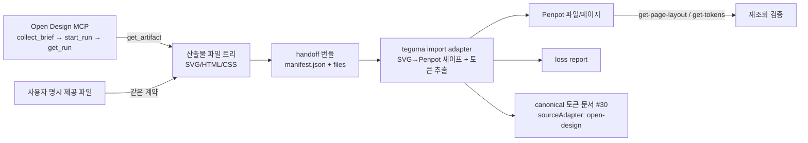

# Open Design 산출물 → teguma/Penpot 핸드오프 POC 명세

> 상태: Implemented (구현 PR #34 — live smoke 실행은 사용자 승인 후, 13장)
>
> 작성일: 2026-08-08
>
> 관련 이슈: [#32](https://github.com/Doyajin174/teguma/issues/32) — Refs #19 #29 #30
>
> 실측 근거: [docs/research/019-open-design-export.md](../research/019-open-design-export.md)

## 1. 목표

Open Design으로 생성한 비식별 샘플 1개를 **공식 산출물 계약** 기준으로 teguma/Penpot에 반입하고, teguma 읽기 도구(`get-page-layout`, `get-tokens`)로 다시 읽어 원본과 비교하는 최소 vertical POC를 정의한다. 처음부터 양방향 동기화나 임의 HTML/CSS 완전 변환을 구현하지 않는다.

이 명세는 다음 계약을 확정한다:

- 선택한 handoff 형식과 근거 (4장)
- handoff 번들 계약 — 입력 형식·provenance (5장)
- 책임 경계 (6장)
- import adapter 최소 범위 — 어떤 입력 → Penpot 페이지 (7장)
- 보존/손실 규칙 (8장)
- loss report 구조 (11장)
- idempotency 정책 (12장)
- live smoke 절차 + CI fixture 분리 (13·14장)
- 완료 조건 (17장 — 이슈 DoD 12개)

## 2. 용어

| 용어 | 의미 |
| --- | --- |
| Open Design 아티팩트 | Open Design 프로젝트의 산출물 — 파일 트리(HTML/JSX/CSS/JSON/SVG/Markdown)와 링크(`previewUrl`/`studioUrl`) |
| handoff 번들 | Open Design 산출물(또는 사용자 제공 파일)을 teguma import 입력으로 포장한 결정적 번들 — `manifest.json` + 파일들 (5장) |
| source id | 산출물의 논리 식별자 — MCP 경로는 `open-design:<runId>:<entryPath>`, 사용자 제공은 `handoff:sha256:<64hex>` (5.3) |
| content hash | 번들 정규화 직렬화의 `sha256:<64hex>` — idempotency·무결성 기준 |
| import adapter | 번들 → Penpot 페이지 변환·쓰기·검증을 담당하는 teguma 코드 (7장) |
| loss report | 원본 대비 반입 결과의 구조화된 손실 보고 (11장) |

## 3. 아키텍처 (개요)



- **Open Design MCP**: 생성·파일 제공 (공식 표면 한정 — 조사 문서 3·5장).
- **teguma import adapter**: 번들 → Penpot 페이지 변환, canonical 토큰 생산, loss report 생성 (7장).
- **Penpot**: 반입 결과의 저장·재조회 대상.
- **사용자**: 외부 자산(이미지·폰트) 라이선스 확인, 명시적 handoff 제공 (6.3).

## 4. handoff 형식 선택과 근거

### 4.1 선택

| 우선순위 | 형식 | 역할 |
| --- | --- | --- |
| primary | **SVG 단일 파일** (아티팩트 엔트리 하나) | Penpot 페이지 반입의 본체 — 텍스트·색상·도형·레이어 보존 |
| 보조 | **CSS 커스텀 프로퍼티** (`--*`) | canonical 토큰 생산 (색·타이포·스페이싱), #30 계약 정렬 |
| 전달 | **명시적 사용자 handoff 번들** | `get_artifact` 결과와 사용자 제공 파일을 같은 계약으로 통일, CI fixture 재사용 |

### 4.2 근거

1. **공식·실측 가능한 경로만 사용** — 조사 문서 4장: 기계 판독 가능한 공식 산출물은 `get_artifact` 파일 트리뿐. preview scraping·내부 API는 이슈 비범위.
2. **Penpot native 수용** — Penpot은 SVG를 셰이프 트리로 파싱할 수 있고(조사 문서 6.1), SVG 안에 텍스트·색상·도형·레이어가 모두 표현 가능 → 이슈 완료 시나리오 1·3 조건 충족.
3. **HTML/CSS 전체 변환은 비범위** (이슈 본문) — HTML은 번들의 참조·provenance 정보로만 쓰고 변환 대상이 아니다.
4. **토큰은 canonical 계약으로** — #30의 `sourceAdapter` enum에 `"open-design"`이 이미 예약돼 있어 (조사 문서 6.3) 손실 보고·결정론 규칙을 그대로 준용.
5. **명시적 handoff가 CI fixture의 근거** — 사용자가 제공한 파일도 같은 번들 계약이므로, 네트워크·시크릿 없이 같은 변환을 CI에서 검증 가능 (14장).

### 4.3 비채택

- preview URL scraping·렌더 캡처 (비공식 우회 — 이슈 비범위)
- Open Design 내부 저장소·비공개 API 접근
- 임의 HTML/CSS 전체 → Penpot 컴포넌트 완전 변환
- 픽셀 동일성 보장
- 실시간 양방향 동기화

## 5. handoff 번들 계약 (v0.1.0)

번들은 **결정적**이다: 동일 입력 → 동일 직렬화 → 동일 `contentHash`. 타임스탬프는 `source.createdAt`(소스 메타데이터)에만 존재하고 번들 직렬화·hash 계산에는 포함하지 않는다.

### 5.1 디렉터리 구조

```text
<bundle>/
├── manifest.json          # 5.2 — 필수
├── <entry>.svg            # primary 엔트리 (1개 이상 — 다중 SVG 규칙: 5.5)
├── tokens.css             # 선택 — CSS 커스텀 프로퍼티
└── (참조 파일)            # 선택 — HTML/CSS/JSON 등 (provenance·검증용)
```

### 5.2 manifest.json

```jsonc
{
  "schemaVersion": "0.1.0",
  "source": {
    "id": "open-design:<runId>:<entryPath>",   // 또는 "handoff:sha256:<64hex>"
    "hash": "sha256:<64hex>",                   // 번들 정규화 직렬화 해시 (5.3)
    "createdAt": "2026-08-08T03:00:00Z",        // 산출물 생성 시각 (RFC3339)
    "tool": "open-design",
    "toolVersion": "0.18.1",
    "mode": "cloud",                            // cloud | local-codex | byok | user-handoff
    "projectId": "…",                           // MCP 경로에서만
    "runId": "…",                               // MCP 경로에서만
    "agentMessageTail": "…",                    // 선택 — get_run의 agentMessage 마지막 500자
    "truncated": false                          // get_artifact truncated 여부 (true면 부분 산출물)
  },
  "files": [
    { "path": "hero-section.svg", "kind": "svg", "hash": "sha256:<64hex>", "bytes": 4812 }
  ],
  "note": "비식별 샘플 — 실제 브랜드 데이터 아님"    // 선택
}
```

### 5.3 정규화 직렬화·해시 규칙

- 파일 순서: `path` 오름차순 (locale 무관 바이트 순).
- 각 파일: `path` + `\n` + 바이트 그대로. manifest는 직렬화 대상에서 제외 (자기참조 방지).
- `contentHash = sha256(연결된 파일 바이트)` — 표기는 `sha256:<64hex>` (prefix 포함).
- `source.id` 규칙: MCP 경로 `open-design:<runId>:<entryPath>`, 사용자 제공 `handoff:sha256:<64hex>` (contentHash 전체).

### 5.4 생성 주체별 획득 절차

| 경로 | 획득 | 비고 |
| --- | --- | --- |
| MCP | `get_artifact({ project, entry })` → 파일 엔트리 | 도구가 노출된 태스크에서만 (조사 문서 2장) |
| 사용자 handoff | 사용자가 파일을 제공 | 같은 번들 계약. CI fixture가 이 경로를 사용 (14장) |

### 5.5 다중 SVG 규칙

- 엔트리 SVG가 2개 이상이면 각 SVG가 **하나의 Penpot 페이지**가 된다 (`manifest.files`의 `path` 오름차순으로 1:1 매핑, 페이지 이름은 12.1 규칙에 엔트리 slug를 결합).
- 손실 항목의 `path`는 `svg://<entryPath>#<요소경로>` 형태로 페이지를 구분한다 (11장).
- 엔트리가 0개(SVG 없음)는 번들 검증 실패로 전체 실패 처리한다 (6.2).

## 6. 책임 경계

| 주체 | 책임 | 비책임 |
| --- | --- | --- |
| Open Design MCP | 생성·파일 트리 제공·링크 전달 | Penpot 쓰기, 변환, 토큰 해석 |
| teguma adapter | 번들 검증 → SVG→Penpot 변환 → 쓰기 → 읽기 검증 → loss report | 디자인 판단(라이선스·role), preview 렌더링 |
| Penpot | 파일·페이지 저장, 셰이프 트리 서빙 | Open Design 산출물 이해 |
| 사용자 | 외부 자산(이미지·폰트) 라이선스 확인, 명시적 handoff 제공, `semanticRole` override 확정 (4.7 규칙 — 추측 금지) | — |

### 6.1 시크릿 경계

- `PENPOT_SESSION_COOKIE`는 `~/.codex/config.toml` 환경변수로만 관리 (기존 정책 유지).
- Open Design cloud/BYOK 크레덴셜은 MCP 내부 전용 — chat·파일·번들·커밋에 노출 금지 (SKILL.md).
- fixture·번들에 개인·회사 시크릿 금지.

### 6.2 실패 시 부분 성공 금지

번들 검증·SVG 파싱·쓰기 중 어느 단계가 실패하면 **전체를 실패로 보고**하고 부분 반입 결과를 성공으로 가장하지 않는다. 해석 불가·모호 항목은 `loss report`의 `unsupported`/`ambiguous`에 명시한다 (11장). 쓰기가 부분 적용된 채 실패하면 기존 페이지를 복원(12.4)하고 실패 사실을 보고한다.

## 7. import adapter 최소 범위

### 7.1 입력·출력

- 입력: handoff 번들 (5장) + Penpot 연결(`fileId` 또는 `teamId`).
- 출력: `ImportResult` — `{ pageId, pageName, summary, lossReport, provenance, action }`.
- 구현 위치(제안): `src/tools/import-open-design.ts` (엔트리), `src/design/open-design/` (파서·변환기·loss). 기존 `import-figma` 패턴 준용.

### 7.2 변환 단계

| 단계 | 내용 | 산출 |
| --- | --- | --- |
| 1. 번들 검증 | schema 검증(zod), `contentHash` 재계산·대조, `truncated` 여부 확인 | 검증 결과 |
| 2. SVG 파싱 | 엔트리 SVG → 요소 트리. 지원 요소 enum: `svg`, `g`, `rect`, `circle`, `ellipse`, `path`, `text`, `image`, `defs`(색·그라디언트 참조용) | SVG IR |
| 3. 셰이프 변환 | SVG IR → Penpot obj 형식 (8장 매핑 규칙) | Penpot 셰이프 트리 |
| 4. 토큰 추출 | `tokens.css`의 `--*` 커스텀 프로퍼티 → canonical 토큰 문서 (`sourceAdapter: "open-design"`, #30 계약) — 선택적 | canonical 문서 |
| 5. 쓰기 | idempotency 정책 적용(12장) → Penpot 페이지 생성/교체 → 쓰기 RPC `update-file` (변화 `add-obj`/`add-page`/`del-obj`) | 페이지 |
| 6. 읽기 검증 | `get-page`(Penpot 셰이프 트리) + `get-page-layout`/`get-tokens`(teguma 읽기 도구) 재조회 → 8장 기준 비교 | 검증 수치 |
| 7. loss report | 11장 스키마로 손실 항목·검증 수치 집계 | loss report |

> **페이지 생성 실측 (2026-08-08, 로컬 Penpot 192.168.0.183:9001)** — 독립 페이지 생성 RPC(`create-page`·`add-page`·`duplicate-page` 등)는 전부 `~:not-found`로 **미노출**이다. 페이지 생성은 `update-file` RPC의 changes 변화 타입 `add-page`로만 가능하다. **live smoke 추가 실측: `add-page` 변화는 `id`/`name` **또는** `page` 중 한 형태만 보내야 한다 — 둘 다 보내면 서버가 `"id+name or page should be provided, never both"`로 거부한다.** teguma `client.ts`에는 이 경로가 없다. 또한 `client.ts`가 현재 사용하는 `commit-changes` RPC 자체도 이 인스턴스에서 `~:not-found`다 (실측 상세: research 6.1). → 구현 시 `update-file` 기반 쓰기 클라이언트(페이지 생성 포함) 추가가 선행 조건이며, 그 전까지 idempotency는 **기존 파일 내 페이지 교체로 제한**한다 (12장).

### 7.3 Penpot 쓰기 경로 비교 (구현 시 확정)

| 경로 | 장점 | 단점 |
| --- | --- | --- |
| `update-file` `add-obj` (createElement 패턴 확장) | 기존 인프라 재사용, 결정적 id 제어 | SVG 파싱·변환을 teguma가 구현해야 함 (현재 svg 타입은 placeholder — 조사 문서 6.1). **실측: client.ts의 `commit-changes`는 로컬 인스턴스에서 `~:not-found` — `update-file` 전환 필요** |
| Penpot native 파일 import (`import-file` RPC) | 서버측 SVG 파싱 품질, UI 드래그드롭과 동일 | RPC 미검증, 페이지·셰이프 id 제어 불가, idempotency 매핑 별도 관리 |

**기본**: `add-obj` 경로 (결정론·idempotency 정책과 정합). `import-file`은 구현 단계에서 SVG 파싱 품질 비교 후 부가 경로로만 채택 가능 — 채택 시 12장 idempotency 규칙을 유지할 수 있는 매핑 기록을 함께 구현한다.

## 8. 보존/손실 규칙 (SVG → Penpot)

| 항목 | 보존 규칙 | 손실 보고 |
| --- | --- | --- |
| **텍스트** | `text` 요소 → Penpot text 셰이프(paragraph-set 구조). `font-family`/`font-size`/`font-weight`/`fill` 보존 | `font-not-found`: 폰트 미설치 → fallback 렌더(`lossy`). `text-as-path`: 텍스트가 경로화돼 편집 불가(`lossy`). `letter-spacing` 미지원(`lossy`, code `dropped-property`) |
| **색상** | `fill`/`stroke` hex → Penpot fill/stroke. 불투명도는 alpha로 변환 | hex 외 표현(색상 이름·`currentColor`·var())은 해석 시도 후 실패 시 `unsupported`. gradient는 v0.2 후보 → `unsupported`(code `unsupported-category`) |
| **프레임** | 최상위 `svg`의 `viewBox`/`width`/`height` → Penpot board(frame). 내부 크기는 CSS 변환 규칙(px 기준) 적용 | `rem`/`em`/`%` 크기 → px 정규화(`lossy`, `conversion` 기록). `vw` 등 비표준 단위 → `unsupported`(code `nonstandard-unit`) |
| **레이어** | `g` → Penpot group, `rect` → rect, `circle` → circle, `ellipse` → **Penpot circle** (ellipse 타입 미지원 — live smoke 실측, selrect 크기로 rx≠ry 보존), `path` → Penpot path 셰이프 (실측 8.2), 중첩 보존, `id`/`name` 보존 | 지원 요소 밖(`filter`/`clipPath`/`mask`/`symbol`/`use` 등) → `unsupported`(code `unsupported-element`) + 해당 서브트리 평탄화 여부 명시. 이름 없음 → 자동 이름(`lossy`) |
| **이미지** | `image` 요소의 data URI는 v0.2 후보. 외부 URL은 **미반입** | 외부 URL: `unsupported`(code `external-url-asset`) — URL·라이선스 미확인 기록, 사용자 확인 요구 (6.3). data URI: `unsupported`(code `embedded-image-v0.2`) |
| **폰트** | `font-family` 목록을 파일 타이포그래피로 기록 | `font-license-unknown`: 라이선스 미확인 — 사용자 확인 전 자동 임베드 금지(`unsupported`). 미설치 폰트 → fallback(`lossy`, code `font-not-found`) |

**보존 최소 기준 (POC 통과선)**: 텍스트 내용·색상 hex·도형 위치/크기(**path 포함** — 실측 8.2)·레이어 중첩 구조. 이 기준을 벗어나는 항목은 전부 loss report에 명시한다 — 조용한 탈락 금지.

### 8.1 좌표·텍스트 변환 규칙

**viewBox → px 좌표 스케일**

- `<svg viewBox="0 0 VBW VBH" width="W" height="H">`: 내부 요소 좌표는 모두 viewBox 좌표계이므로 px로 스케일한다.
- `preserveAspectRatio="none"`(또는 명시적 비균일): `sx = W / VBW`, `sy = H / VBH` 독립 스케일 → `px = viewBox × (sx, sy)`.
- 기본값(`xMidYMid meet`) 및 기타 `meet`: `s = min(W / VBW, H / VBH)`, 중앙 정렬 offset `ox = (W − VBW·s) / 2`, `oy = (H − VBH·s) / 2` → `px = viewBox × s + (ox, oy)`.
- `slice`: `s = max(W / VBW, H / VBH)` + 중앙 정렬 offset. 넘치는 영역은 크롭되며 `lossy`(code `viewport-cropped`)로 보고한다.
- `viewBox` 부재 시: `x`/`y`는 0, `width`/`height` 속성값을 그대로 사용한다.

**SVG text baseline → Penpot 텍스트 박스 (상단 기준)**

- Penpot text 셰이프의 위치는 박스 **좌상단** 기준이다. SVG `text`의 `(x, y)`는 **baseline** 기준이므로 보정이 필요하다.
- `dominant-baseline`(상속 포함)별 보정: `auto`/`alphabetic`(기본) → 박스 상단 `= y − ascent` (ascent ≈ `font-size × 0.8` 보수 추정, `lossy`(code `baseline-estimated`) 기록). `middle` → `y − font-size / 2`. `central` → `y − font-size / 2`. `hanging` → `y` (보정 없음). `text-before-edge` → `y`.
- 박스 좌측 `x`는 그대로 사용. `text-anchor`(start/middle/end)는 박스 정렬로 변환하고 `lossy`(code `text-anchor-converted`) 기록.
- 다중 `tspan`·`dy` 오프셋은 각 라인 박스로 분해하고 라인 간격은 `line-height`로 기록한다. 해석 불가 시 `ambiguous`(code `tspan-unresolved`).

### 8.2 path 셰이프 생성 실측

**결과: `add-obj`로 path 셰이프 생성 가능** (2026-08-08 로컬 Penpot 192.168.0.183:9001 실측 — `update-file` changes `add-obj`, `type: "path"`). 생성·재조회 왕복으로 확인했으며, 서버 스키마가 요구하는 필드는 다음과 같다 (research 6.1):

- `content` — **원본 SVG `d` 문자열** (live smoke 실측 2026-08-08: 서버는 명령 배열을 수용하지 않고 NPE — 정규화된 path 문자열로 저장·응답한다. `M120 320 … Z` 형태). SVG `d` 파싱은 bbox 계산·명령 검증에만 사용.
- `selrect` — `{ x, y, width, height, x1, y1, x2, y2 }` 바운딩 박스.
- `points` — 4개 점 (`[{x,y} × 4]`).
- `transform` / `transform-inverse` — identity matrix.
- `parent-id` / `frame-id` — 부모·프레임 uuid (root는 `00000000-0000-0000-0000-000000000000`).

→ path 요소는 POC 통과선에 포함한다. SVG `d`의 곡선 명령(`C`/`Q`/`A` 등)은 Penpot path 명령으로 매핑하고, 매핑 불가 명령은 `unsupported`(code `unsupported-element`)로 보고한다.

## 9. 토큰 추출 규칙 (CSS → canonical)

- 입력: `tokens.css`의 커스텀 프로퍼티(`--color-*`, `--font-*`, `--space-*` 등) 또는 SVG 인라인 스타일에서 추출한 값.
- 출력: [#30 canonical 토큰 문서](../specs/018-canonical-token-contract.md) — `document.sourceAdapter: "open-design"`, `provenance.sourceId` = 번들 source id, 결정론 정렬(4.8) 준수.
- **산출물 귀착지**: canonical 문서는 `data/imports/open-design/<sourceIdSlug>/tokens.canonical.json`에 저장하고 (10장), import 도구 응답(`ImportResult`)에 canonical 요약(토큰 수·mode·손실 요약)을 포함한다. 재조회 검증은 저장된 canonical 문서와 대조한다 (13.5 한계 참조).
- **`tokens.css` 부재 시**: 토큰 추출 단계를 생략한다 — canonical 문서를 생산하지 않고, loss report에서 `token` category를 생략한다 (부재 자체를 손실로 보고하지 않음).
- mode: Open Design 산출물에 light/dark 개념 없음 → `values.default`에만 기록 (Penpot 어댑터와 동일 규칙).
- 해석 불가(중첩 var 참조 미해결·비표준 단위) → `importLoss.unsupported`/`lossy` (code: `css-var-unresolved`, `nonstandard-unit`).
- `semanticRole`: 추측 금지 — `unknown` 또는 사용자 override만 (4.7 규칙).
- **canonical 문서에는 타임스탬프를 두지 않는다** — `createdAt`은 번들·import 기록에만 (5장, 조사 문서 6.3).

## 10. provenance 기록

반입 결과마다 다음을 보존한다 (번들 manifest 5.2 + import 기록):

- `source.id` (source hash/id) — `open-design:<runId>:<entryPath>` 또는 `handoff:sha256:<64hex>` (5.3)
- `source.hash` — 번들 content hash (`sha256:<64hex>`)
- `source.createdAt` — 산출물 생성 시각
- `source.tool` / `source.toolVersion` — `open-design` / 앱 버전 (현재 0.18.1)
- `source.mode` — cloud / local-codex / byok / user-handoff
- `projectId`/`runId` (MCP 경로), `truncated` 여부
- import 기록: `importedAt`, Penpot `fileId`/`pageId`/`pageName`, adapter 버전

import 기록은 `data/imports/open-design/<sourceIdSlug>.json`에 저장한다 (시크릿 없음, gitignore 불필요 — data/는 수집 데이터 디렉토리).

**`sourceIdSlug` 정의**: source id의 파일명 안전 슬러그 — `od-<sourceId12>` (sourceId12 = sha256(source id) 앞 12hex — 12.1과 동일 규칙). MCP 경로(`open-design:<runId>:<entryPath>`)는 `od-<sourceId12>-<entryPath 슬러그>` (entryPath의 비알파벳 문자를 `-`로 치환).

## 11. loss report 구조 (v0.1.0)

canonical `importLoss` 어휘(`unsupported`/`ambiguous`/`lossy`)와 [#30 4.8 정렬 규칙](../specs/018-canonical-token-contract.md)을 준용한다. 손실 항목은 이슈 요구 항목별 category로 구분한다.

```jsonc
{
  "schemaVersion": "0.1.0",
  "source": { "id": "…", "hash": "sha256:…", "createdAt": "…", "tool": "open-design", "toolVersion": "0.18.1" },
  "summary": {
    "layers": { "source": 42, "imported": 39, "unsupported": 3 },
    "text": { "source": 6, "imported": 6, "lossy": 1 },
    "colors": { "source": 5, "imported": 4, "unsupported": 1 },
    "frames": { "source": 1, "imported": 1 },
    "images": { "source": 1, "imported": 0, "unsupported": 1 },
    "fonts": { "source": 2, "imported": 1, "lossy": 1 }
  },
  "items": [
    {
      "category": "text",            // text | color | frame | layer | image | font | token
      "severity": "lossy",           // unsupported | ambiguous | lossy
      "code": "font-not-found",
      "path": "svg://text[2]",       // SVG 트리 경로 (원본 위치)
      "reason": "Open Sans 미설치 — fallback 'Inter' 렌더",
      "original": { "fontFamily": "Open Sans", "fontSize": "1.25rem" },
      "converted": { "value": 20, "unit": "px" }
    }
  ]
}
```

- `category` 폐쇄 enum: `text | color | frame | layer | image | font | token`.
- `severity` 폐쇄 enum: `unsupported | ambiguous | lossy` (canonical `importLoss`와 동일 어휘).
- `code` 폐쇄 enum (8·9장에서 정의된 값): `unsupported-category` · `nonstandard-unit` · `unsupported-element` · `external-url-asset` · `embedded-image-v0.2` · `font-license-unknown` · `font-not-found` · `text-as-path` · `dropped-property` · `css-var-unresolved` · `baseline-estimated` · `text-anchor-converted` · `tspan-unresolved` · `viewport-cropped` · `partial-artifact`. 새 code 추가는 계약 변경(schemaVersion bump).
- **`original` / `converted` 필드 정의** (#30 `CanonicalLossItem` 정합 — `original`은 lossy 전용, `converted`는 canonical 스칼라 형태):
  - `original` — 원문 그대로 (구조 보존, stringify 금지). 예: `{ "fontSize": "1.25rem" }`.
  - `converted` — canonical 값 형태 (`CanonicalScalar` = `{ value, unit? }` — #30 4.3, 4.5). 예: `{ "value": 20, "unit": "px" }`. 단위·타입은 #30 canonical 스칼라 어휘를 사용하며 손실 항목 외 새 표현 금지.
- **항목 정렬 (#30 4.8 명시적 정합)**: severity 그룹 순서 `unsupported` → `ambiguous` → `lossy` → 항목 내 `path` 오름차순 → `code` 오름차순. 동률이면 `original` 직렬화 문자열 오름차순 → `reason` 오름차순 (입력 순서 의존 제거). #30 4.8의 `tokenId`/`mode` 차원은 token category 항목에만 적용한다 (`tokenId` 없으면 `path`, `mode`는 `default`→`light`→`dark`, 없으면 생략).
- **truncated 번들**: `source.truncated: true`면 loss report 최상단에 `partial-artifact` 항목을 추가한다 (부분 산출물임을 명시 — 조사 문서 5장).
- 검증 수치(원본 vs 반입 레이어 수·텍스트·색상·타이포·크기)는 `summary`에, 항목별 상세는 `items`에 담는다.

## 12. idempotency 정책

### 12.1 식별자

- **source id**: `open-design:<runId>:<entryPath>` 또는 `handoff:sha256:<64hex>` (5.3) — 산출물의 논리 identity.
- **content hash**: 번들 정규화 직렬화 `sha256:<64hex>` (5.3) — 내용 변경 감지.
- **Penpot 페이지 이름**: `od-handoff-<sourceId12>-<hash12>` (`sourceId12` = sha256(source id) 앞 12hex, `hash12` = content hash 앞 12hex) — 이름 기반 탐지로 매핑 유지.

### 12.2 실행 규칙

| 상황 | 행동 | 결과 `action` |
| --- | --- | --- |
| 같은 source id + 같은 content hash + 페이지 존재 | **skip** — 쓰기 없음, 기존 페이지 반환, loss report 재계산(결정론) | `unchanged` |
| 같은 source id + 다른 content hash | **overwrite** — `od-handoff-<sourceId12>-*` 페이지 삭제 후 새 페이지 생성 (이전 pageId는 결과에 기록) | `replaced` |
| 같은 source id + 페이지 없음 | 신규 생성 | `created` |
| 다른 source id | 항상 신규 생성 (소스 구분) | `created` |
| `force: true` (기본 false) | 같은 hash여도 삭제·재생성 (Penpot 쪽 수동 편집 drift 복구용) | `replaced` |

### 12.3 결정 함수

`resolveImportAction(sourceId, contentHash, existingPages, force)` — 순수 함수로 분리해 CI에서 테스트 (14장). `existingPages`는 페이지 이름 prefix `od-handoff-<sourceId12>-` 매칭으로 구성한다.

### 12.4 실패 시 복구

overwrite 중 쓰기 실패 → 기존 페이지 삭제 전 **백업 pageId 기록**(이전 페이지는 삭제 직전에 이름을 `od-handoff-<sourceId12>-<hash12>-backup-<epochMs>`로 변경) 후 실패 보고. 백업 pageId·변경 시각은 **import 기록(`data/imports/open-design/<sourceIdSlug>.json`, 10장)에 남긴다** (복구 시 조회 가능). 성공 시 백업 페이지 삭제.

### 12.5 runId 의존 한계

- source id가 `runId`에 의존하므로, **같은 디자인을 다시 생성하면 새 runId → 새 source id → 기존 페이지와 무관한 신규 페이지**가 생긴다 (12.2 "다른 source id → `created`"). 내용이 같아 content hash가 같아도 source id가 다르면 dedup되지 않는다.
- 중복 페이지 정리(같은 이름 계열 페이지 일괄 삭제 명령 등)와 runId 독립 식별(예: 브리프 기준 id)은 v0.2 후보로 분리한다. POC에서는 "디자인 재생성 = 새 페이지"임을 명시적으로 보고한다.

## 13. live smoke 절차 (구현 단계, CI 제외)

**전제**: open-design MCP 도구가 노출된 새 Codex 태스크 (`codex mcp get open-design --json` → enabled), Penpot HTTP 200, `PENPOT_URL`/`PENPOT_SESSION_COOKIE` 설정. 스크립트: `scripts/smoke-open-design-handoff.sh` (opt-in, CI 미포함).

1. **생성** — Open Design으로 비식별 랜딩 섹션 1개를 SVG 엔트리로 생성: `collect_brief` → `confirm_brief` → `start_run` → `get_run` (성공 시 `previewUrl` 기록, `succeeded`까지 폴링).
2. **산출물 획득** — `get_artifact({ project, entry })`로 SVG 엔트리 + 참조 파일 획득, `truncated` 확인.
3. **번들 생성** — 5장 계약으로 `manifest.json` + 파일 구성, content hash 계산. `data/imports/open-design/<sourceIdSlug>/`에 저장.
4. **반입** — import adapter 실행 (7장): Penpot 페이지 생성/교체, canonical 토큰 생산.
5. **재조회** — `get-page-layout`(페이지 셰이프 트리), `get-tokens`(colors/typography)로 반입 결과 조회. **한계: `get-tokens`는 압축 토큰 기준이다 — canonical 왕복 재조회(`includeCanonical`)는 #30 v0.1 후속이므로 POC에서는 압축 토큰 비교로 대체하고, canonical 문서 자체는 9장 귀착지(`data/imports/.../tokens.canonical.json`) 산출물로 검증한다.**
6. **비교·통과 판정** — 8장 보존 최소 기준 + loss report `summary` 기준. 통과 조건: 레이어 수·텍스트·색상이 loss report 범위 내에서 일치, `unsupported` 항목이 명시 보고됨.
7. **idempotency 재현** — 같은 번들로 재실행 → `action: "unchanged"` 확인. 번들 수정 후 재실행 → `action: "replaced"` 확인.
8. **정리** — 스모크 결과 요약을 이슈 코멘트·PR에 기록 (산출물·링크·loss report 요약; 릴리스 리포트 문서가 아니므로 `docs/releases`에는 작성하지 않음). 샘플에 시크릿 없음 확인.

## 14. CI fixture 분리

### 14.1 fixture

```text
data/fixtures/open-design-handoff/
├── hero-section.svg          # 비식별 샘플 (텍스트·색상·도형 포함, 외부 URL 이미지 1개 — 손실 항목 재현용)
├── tokens.css                # 커스텀 프로퍼티 6~8개
├── manifest.json             # source.id = handoff:sha256:<64hex>, mode: user-handoff
└── expected-import.json      # 결정론 기대값 — 셰이프 수·토큰 수·loss report (정렬 규칙 적용)
```

- fixture는 **커밋 가능·비식별**: 실제 브랜드 데이터·시크릿·외부 개인정보 금지. 외부 URL 이미지는 가짜 도메인(`https://example.invalid/...`) 사용.

### 14.2 CI 테스트 (네트워크·시크릿 없음)

| 테스트 | 대상 |
| --- | --- |
| 번들 검증·hash 결정론 | manifest 스키마·정규화 직렬화 (5장) |
| SVG 파싱 → Penpot 셰이프 | 파서 (7.2-2·3) — fixture 입력, expected 셰이프 수·속성 대조 |
| 토큰 추출 | CSS → canonical (9장) — #30 스키마 검증 포함 |
| loss report 결정론 | 11장 — 동일 입력 → 동일 JSON, 정렬 규칙 |
| idempotency 결정 | `resolveImportAction` (12.3) — unchanged/replaced/created/force 시나리오 |
| **Penpot 쓰기는 테스트하지 않음** | RPC 호출은 mock/추상화 경계 (인터페이스 주입) |

- live smoke(13장)는 네트워크·시크릿 필요 → CI 제외. CI는 동일 변환 로직을 fixture로 검증.
- 구현 PR의 전체 테스트·빌드 통과가 머지 조건 (DoD 11).

## 15. README·운영 문서 갱신 (구현 단계)

- `README.md` 또는 [017-open-design-penpot-integration.md](017-open-design-penpot-integration.md)에 실제 사용 순서(생성 → 번들 → 반입 → 재조회)와 시크릿 경계(6.1)를 기록한다.
- `import-open-design` 도구의 인자·출력 예시를 포함한다 (DoD 10).

## 16. 리스크

| 리스크 | 대응 |
| --- | --- |
| open-design MCP 도구가 태스크에 미노출 | 새 태스크에서 스냅샷 로드 (조사 문서 8장). smoke는 구현 단계 태스크에서 |
| `get_artifact` cap(1.5MB·200파일) | POC는 작은 샘플 1개. `truncated`는 loss report에 명시 (11장) |
| 외부 이미지·폰트 미반입 | 라이선스·가용성은 사용자 확인 항목 (6.3, 8장) — v0.2 후보로 분리 |
| SVG 파싱 품질 | `add-obj` 경로 기본, `import-file` 비교 후 부가 채택 (7.3) |
| Penpot 페이지 id 비제어 | 페이지 **이름 기반** idempotency (12.1) — id 의존 없음 |
| canonical 계약과의 정렬 오류 | #30 스키마·정렬 규칙을 그대로 사용, 새 어휘 금지 (9·11장) |

## 17. 완료 조건 (Definition of Done — 이슈 12개 반영)

- [x] 1. Open Design 공식/실측 export capability 조사 문서 — `docs/research/019-open-design-export.md`
- [x] 2. 선택한 handoff 형식·책임 경계·보존/손실 규칙 명세 — 본 문서 (4·6·8장)
- [ ] 3. 비식별 Open Design 샘플과 source provenance 기록 — 구현 PR에서 fixture·번들로 (13·14장)
- [ ] 4. 샘플 1개를 Penpot 페이지로 반입하는 최소 adapter 또는 명시적 handoff 명령 구현 — `import-open-design` (7장)
- [ ] 5. 반입 후 teguma 읽기 도구로 페이지·토큰을 재조회하는 live smoke 절차 — 13장 절차 확립 + 실행
- [ ] 6. CI에서 네트워크·시크릿 없이 같은 변환을 검증하는 fixture 테스트 — 14장
- [ ] 7. 텍스트·색상·프레임·레이어·이미지/폰트 항목별 구조화된 loss report — 11장 스키마 구현
- [ ] 8. 동일 source hash/id 재실행 시 idempotency 정책 테스트 — 12장 + CI 결정 함수 테스트
- [ ] 9. 실패 시 부분 성공으로 가장하지 않고 unsupported/ambiguous 항목을 명시적으로 보고 — 6.2·11장
- [ ] 10. README 또는 운영 문서에 실제 사용 순서와 시크릿 경계 기록 — 15장
- [ ] 11. 전체 테스트·빌드 통과
- [ ] 12. PR → 셀프 리뷰 → 독립 AI 리뷰 → squash merge

## 18. 비목표 (후속 이슈 후보)

- gradient·data URI 이미지·컴포넌트/인스턴스 보존 (v0.2)
- Open Design ↔ Penpot 양방향 동기화
- DTCG import projection (#30 v0.2)
- 임의 HTML/CSS 전체 변환

## 19. 리뷰 반영 (PR #34 — Jason 리뷰, 2026-08-08)

이 문서와 [research 019](../research/019-open-design-export.md)에 반영한 지적 사항:

| 지적 | 반영 |
| --- | --- |
| H1 — Penpot 페이지 생성 RPC 실측 | 7.2 실측 노트·7.3·12장 — 독립 페이지 생성 RPC 미노출(`~:not-found`), `update-file` changes `add-page`로만 생성 가능, `client.ts`에 경로 없음 → 구현 전까지 idempotency는 기존 파일 내 페이지 교체로 제한 (research 6.1) |
| H2 — SVG path의 Penpot 표현 | 8.2 — `add-obj` `type: "path"` 생성 가능 실측(요구 필드 포함), path는 POC 통과선에 포함 |
| H3 — viewBox→px·text baseline→박스 변환 규칙 | 8.1 — 좌표 스케일·preserveAspectRatio·dominant-baseline 보정 규칙 추가 |
| M1 — loss report items 스키마·정렬 | 11장 — `original`/`converted` 정의(#30 `CanonicalLossItem` 정합), 정렬을 #30 4.8(severity 그룹·mode·동률)과 명시적 정합 |
| M2 — 깨진 참조 | research 8장 "(명세 6.4)" → "(명세 6.3)" 정정 |
| M3 — canonical 저장·반환 경로 | 9장 — `data/imports/.../tokens.canonical.json` 저장 + 도구 응답 포함, 13.5 — `includeCanonical`은 #30 후속, POC는 압축 토큰 비교로 대체 |
| M4 — source id runId 의존성 한계 | 12.5 — 재생성 시 새 runId → 새 source id → 중복 페이지 한계 명시 |
| M5 — 도구명 통일 | 1·3·7.2·13장 — 실코드 기준 `get-page-layout`/`get-tokens`로 통일 |
| L1 — hash 표기 통일 | 2·5.2·5.3·10·12·14장 — `sha256:` prefix(`handoff:sha256:<64hex>`) 통일 |
| L2 — 다중 SVG 규칙 | 5.5 — SVG 1개당 Penpot 페이지 1개 매핑, 손실 path 구분 |
| L3 — mapped→override 표현 정정 | 6장 — `semanticRole` override 확정 (4.7 규칙) |
| L4 — 백업 페이지 기록 위치 | 12.4 — import 기록(`data/imports/open-design/<sourceIdSlug>.json`)에 백업 pageId 명시 |
| L5 — sourceIdSlug 정의 | 10장 — `od-<sourceId12>` 규칙 정의 |
| L6 — tokens.css 부재 시 생략 | 9장 — 토큰 추출 생략·token category 미보고 |
| L7 — #30 참조 명시 | 9·11장 — canonical 문서 링크·4.8 정렬 규칙 참조 명시 |
| L8 — 13.8 표현 정리 | 13장 8단계 — "릴리스 리포트가 아님"으로 정리 |
| L9 — loss code 폐쇄 enum 목록 | 11장 — severity/code 폐쇄 enum 목록 명시 |
