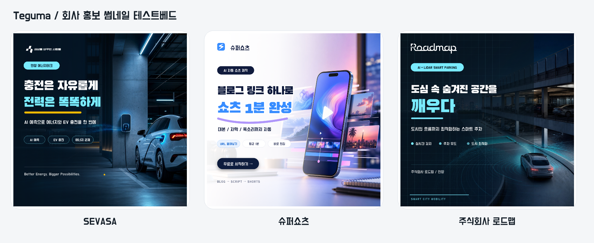

# 회사 홍보 썸네일 테스트베드

SEVASA, 슈퍼쇼츠, 주식회사 로드맵의 공식 메시지를 서로 다른 템플릿 문법으로 렌더하는 1080×1080 실험이다.



## 다시 생성하기

저장소 루트에서 실행한다.

```bash
npm install
npm run testbed:promo
```

출력은 `output/`에 생성된다.

| 파일 | 설명 |
|---|---|
| `sevasa.png` | 에너지·EV B2B 기술형 |
| `supershorts.png` | 크리에이터 서비스형 |
| `roadmap.png` | AI·LiDAR 스마트시티형 |
| `contact-sheet.png` | 3종 비교판 |
| `*.svg` | 편집 가능한 벡터 중간 결과(재생성 가능, Git 제외) |
| `qa-report.json` | 레이아웃·대비·해상도 검사 |

## 구조

```text
campaigns.json         구조화된 카피·팔레트·안전영역
render.mjs             템플릿 컴파일, SVG/PNG 렌더, QA
assets/backgrounds/    텍스트 없는 생성 배경(JPEG 압축 픽스처)
assets/logos/          공식 브랜드 마크
assets/fonts/          OFL 한글 폰트
output/                재현 가능한 산출물
```

## 설계 원칙

- 생성형 이미지는 배경에만 사용한다.
- 한글과 로고는 실제 SVG 레이어로 합성한다.
- 피사체와 텍스트의 영역을 분리한다.
- 한 입력에서 여러 레이아웃을 만들 수 있는 슬롯 구조를 유지한다.
- 자동 QA 뒤에도 실제 이미지를 눈으로 확인한다.

## 자산 출처

- SEVASA 로고와 메시지: [공식 사이트](https://www.sevasa.co.kr/)
- 슈퍼쇼츠 로고와 메시지: [공식 사이트](https://www.supershorts.co.kr/), 로컬 슈퍼쇼츠 저장소
- 로드맵 로고와 메시지: [공식 사이트](https://roadmap.ne.kr/)
- `Black Han Sans`, `Do Hyeon`: [Google Fonts 저장소](https://github.com/google/fonts), SIL Open Font License 1.1
- 배경 3종: OpenAI 내장 이미지 생성 도구로 이 테스트를 위해 새로 생성

생성 직후 원본 PNG와 생성 이력은 [스톡 라이브러리](../../stock/generated/company-promo/README.md)에 별도로 보관한다. 이 폴더의 JPEG는 렌더 속도와 저장 용량을 위해 압축한 파생 픽스처다.

AI 특유의 네온·홀로그램·과도한 디스플레이 타이포를 줄인 후속안은 [에디토리얼 v2](../company-promo-editorial-v2/README.md)에서 비교할 수 있다.

브랜드 마크의 권리는 각 소유자에게 있으며 이 저장소에서는 기능 검증용 픽스처로만 사용한다.

`output/*.svg`는 배경을 data URI로 포함해 파일이 커지므로 Git에는 넣지 않는다. 렌더 명령을 실행하면 PNG와 함께 다시 생성된다.
